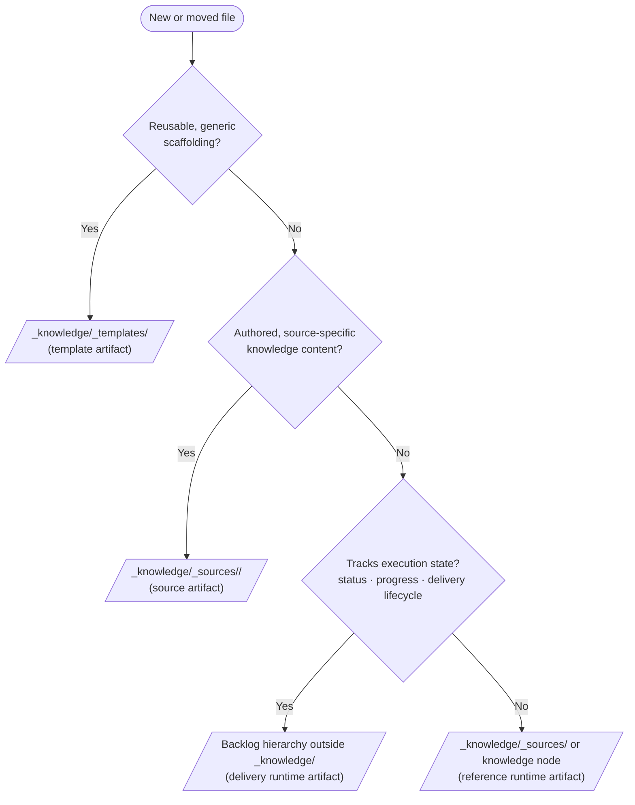

# Knowledge System Rules

## Purpose
Defines the canonical structure for long-lived reference knowledge in this repository, including books, papers, wiki packs, and study-session maps.

This system is intentionally different from delivery tickets:
1. It is reference-first, not execution-first.
2. It does not require project lifecycle fields such as `status` or `progress`.
3. It is reorganized only when new knowledge is added or topology improves.

## Location and Scope
Knowledge content lives under:

- [../_knowledge/README.md](../_knowledge/README.md)
- Canonical authored source content: `../_knowledge/_sources/`
- Reusable scaffolds only (knowledge + backlog): `../_knowledge/_templates/`

Backlog and knowledge templates are co-located under `../_knowledge/_templates/`, but instantiated backlog tickets remain outside `_knowledge/`.

Backlog tickets and knowledge nodes may link to each other, but they must remain structurally separate.

## Template Families (Disambiguation)

Two template families intentionally share one template root:

1. Delivery template family (execution planning)
  - Path: `../_knowledge/_templates/<epic-hex-id>_<epic-slug>/...`
  - Includes: epic, feature, story, task templates
  - Uses lifecycle fields such as `status` and `progress`
  - Instantiation target: backlog root hierarchy (outside `_knowledge/`)

2. Knowledge template family (reference graph)
  - Path: `../_knowledge/_templates/<source-hex-id>_<source-slug>/...`
  - Includes: source, topic, subtopic templates
  - Does not use delivery lifecycle tracking
  - Instantiation target: `_knowledge/_sources/` and related knowledge nodes

Co-location of templates is for discoverability only. Runtime location still follows each system's structural contract.

## Template vs Source Decision Table

Use this flowchart whenever creating or moving files:



Decision priority:
1. Runtime intent wins over folder convenience.
2. Co-location under `_knowledge/_templates/` never changes runtime destination.
3. Delivery lifecycle fields are a hard boundary between reference knowledge and execution tracking.

## Authoring Workflow (Required Split)

1. Select template family in `../_knowledge/_templates/`.
2. Instantiate into the correct runtime location:
  - Delivery template -> backlog hierarchy (outside `_knowledge/`).
  - Knowledge template -> `_knowledge/_sources/` (and related knowledge nodes).
3. Register or update source entry in `Catalog.md` when creating or restructuring a source.
4. Verify navigation links point to direct parent/child nodes only.
5. Do not relocate runtime files back into templates.

## Folder Model

```text
_knowledge/
  README.md
  Catalog.md
  _sources/
    <source-title>/
      source.md (or source-specific files)
  _templates/
    <epic-hex-id>_<epic-slug>/
      Overview.md
      Directive.md
      <feature-hex-id>_<feature-slug>/
        Overview.md
        <story-hex-id>_<story-slug>/
          Overview.md
          <task-hex-id>_<task-slug>.md
    <source-hex-id>_<source-slug>/
      Overview.md
      Quick-Reference.md
      Snippets.md
      Topics.md
      Sessions.md
      <topic-hex-id>_<topic-slug>/
        Overview.md
        Snippets.md
        Links.md
        <subtopic-hex-id>_<subtopic-slug>/
          Overview.md
          Snippets.md
          Links.md
```

## Naming and IDs

| Element | Format |
|---|---|
| Canonical source folder (`_sources`) | `<Source-Title>` |
| Template source folder (`_templates`) | `<HierarchicalHexId>_<Title-Slug>` |
| Topic folder (within templates) | `<HierarchicalHexId>_<Topic-Slug>` |
| Source entry files | `Overview.md`, `Quick-Reference.md`, `Snippets.md`, `Topics.md`, `Sessions.md` |
| Topic files | `Overview.md`, `Snippets.md`, `Links.md` |

Rules:
1. IDs are stable and never reused.
2. Slugs use `Kebab-Case-Words`.
3. Topic folders only represent conceptual groupings, not chapter numbering requirements.

## ID Strategy

Use a dual-ID model to separate catalog identity from node topology:

1. `source_id` identifies the source in `Catalog.md` (for example, `FS-0001`).
2. `id` uses hierarchical hex for source/topic template nodes (for example, `02000000`, `02010000`).
3. Topic `parent` references the hierarchical hex parent node.
4. Catalog rows should include `source_id`; node-level files should include hierarchical `id`.

## Source Frontmatter (Minimal Maintenance)
Use this frontmatter in source-level `Overview.md`:

```yaml
---
source_id: "FS-0001"
id: "02000000"
type: knowledge-source
title: "Source Title"
source_kind: book # book | paper | wiki | notes
authors:
  - Author Name
created: 2026-07-16
updated: 2026-07-16
tags:
  - domain:replace-me
  - kind:reference
links:
  canonical: ""
---
```

Do not add `status`, `progress`, or sprint-like operational fields.

## Topic Frontmatter
Use this frontmatter in topic `Overview.md`:

```yaml
---
id: "02010000"
type: knowledge-topic
title: "Topic Title"
parent: "02000000"
created: 2026-07-16
updated: 2026-07-16
tags:
  - domain:replace-me
  - kind:topic
key_terms:
  - term-a
  - term-b
---
```

## Navigation Contract
Every knowledge node must include a `## Navigation` section with direct links only:
1. Link to knowledge root catalog.
2. Link to direct parent node.
3. Link to direct child topic nodes.

Never flatten all descendants into one page.

## Study Session Logging
Study sessions are captured in source-level `Sessions.md` as append-only entries.

Required session fields per entry:
1. Date/time.
2. Focus question.
3. Topics touched (links).
4. Key insights.
5. Follow-up links to new or updated topic nodes.

This enables a mind-map style growth model while preserving chronology.

## Snippet and Summary Rules

1. `Quick-Reference.md` contains short distilled guidance.
2. `Snippets.md` stores reusable excerpted ideas (with citation context where applicable).
3. Topic `Snippets.md` should be scoped tightly to that node.
4. `Links.md` documents related internal and external references.

## Graph Consistency

1. Parent-child structure is authoritative for traversal.
2. Cross-topic relationships are declared in `Links.md` with explicit reason text.
3. Keep links directional where possible to reduce noisy duplication.
4. Update `updated` when adding meaningful knowledge or restructuring folders.

## Interop With Backlog System

1. Backlog tickets may cite knowledge nodes in `Delivery Notes` or `Dependencies` comments.
2. Knowledge nodes may cite relevant epics/features as implementation examples.
3. Do not move instantiated ticket files into `_knowledge`.
4. Do not force ticket lifecycle conventions onto knowledge files.
